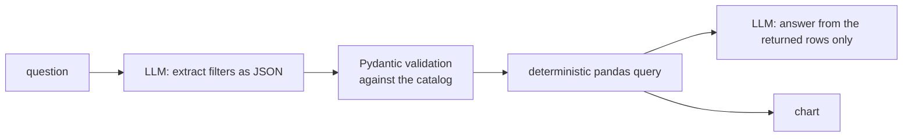

# Delivery Ops Intelligence

[](https://github.com/CamiloC0rtes/delivery-ops-intelligence/actions/workflows/ci.yml)

Ask questions about weekly delivery-operations metrics in plain Spanish — *"¿qué 5 zonas cayeron más en órdenes?"*, *"compara Perfect Orders entre zonas Wealthy y Non Wealthy"* — and get an answer built only from the rows that were actually queried, plus a chart. An insight engine flags anomalies, sustained declines, laggards and opportunities on its own.

**Stack:** FastAPI · OpenAI · pandas · Pydantic · Chart.js · GitHub Actions

> The repo ships with a **synthetic dataset** (108 zones, 6 countries, 9 weeks, 10 metrics) with the same structure as the original. Every zone name and number is invented; a few patterns are planted on purpose so there is something real to find.

---

## How a question is answered



The LLM never computes numbers and never writes code. It only (1) turns the question into filters and (2) explains the rows pandas returned.

- **Validation layer (`entities.py`)** — whatever the model returns is checked against `catalog.py`: unknown metrics or countries are dropped instead of guessed, `top_n` is coerced and clamped (`"five"` → 5, `999` → 50), enums fall back to safe defaults, and malformed JSON degrades to a summary instead of an error.
- **Fixed filter vocabulary** — semantic concepts like *"deterioro sostenido"* map to conditions from a fixed table; nothing the model writes is executed.
- **Follow-ups** — *"¿y en Argentina?"* keeps the previous metric and ranking and swaps only the country.

## Evaluation

`tests/eval/golden.jsonl` holds 12 questions (rankings, filters, comparisons, multi-metric, correlations, a follow-up). For each one the eval checks:

| Check | Question it answers |
|---|---|
| **Extraction** | Did the LLM produce the expected filters (metric, country, top_n, direction…)? |
| **Grounding** | Does the answer mention the top zones that pandas returns for those filters? |
| **Fabrication** | Does the answer name any real zone that is *not* in the queried result? |

Ground truth comes from the same deterministic engine, so a wrong extraction shows up as both an extraction miss and a grounding miss.

```bash
OPENAI_API_KEY=... python -m tests.eval.run_eval      # writes eval_report.md
```

It also runs from **Actions → Accuracy eval** (needs an `OPENAI_API_KEY` repo secret).

## Insight engine

Runs at start-up over every zone × metric and ranks findings by severity:

- **Anomalies** — week-over-week swings beyond ±10 %
- **Sustained trends** — 3+ consecutive weeks down or up. Severity scales with the size of the move, so a 0.1 % wobble is not reported as an incident
- **Benchmarks** — zones more than 1.5 σ below their city
- **Opportunities** and **correlations** between metrics

## Run it

```bash
pip install -r requirements.txt
cp .env.example .env          # add OPENAI_API_KEY to enable the chat (optional)
python app.py                 # http://localhost:8000
```

Without a key the app still starts: dashboards, insights and zone charts work; only the chat is disabled.

```bash
python scripts/generate_data.py --seed 7   # regenerate the synthetic dataset
python validate_data.py                    # schema and quality checks for any input file
DATA_FILE=path/to/your.xlsx python app.py  # run on your own data with the same structure
```

## Tests

```bash
pip install -r requirements-dev.txt
pytest          # 64 tests, LLM mocked — runs in CI on every push
```

They cover the validation layer (garbage JSON, unknown values, clamping), query results against pandas, the generator's schema and planted patterns, every API endpoint, the chat flow with a fake LLM, and the eval's own scoring.

## Project layout

| File | Role |
|---|---|
| `app.py` | FastAPI app, prompts, chat flow and dashboard endpoints |
| `catalog.py` | Single source of truth for metrics, aliases, countries and cities |
| `entities.py` | Validation of the LLM's extracted filters |
| `query_engine.py` | Deterministic pandas queries |
| `insights.py` | Automatic insight detection |
| `data_loader.py` | Wide → long transform and per-zone features (WoW change, slope, z-score) |
| `scripts/generate_data.py` | Synthetic dataset generator |
| `static/index.html` | Single-page UI: chat with charts, insights, zone trends |
